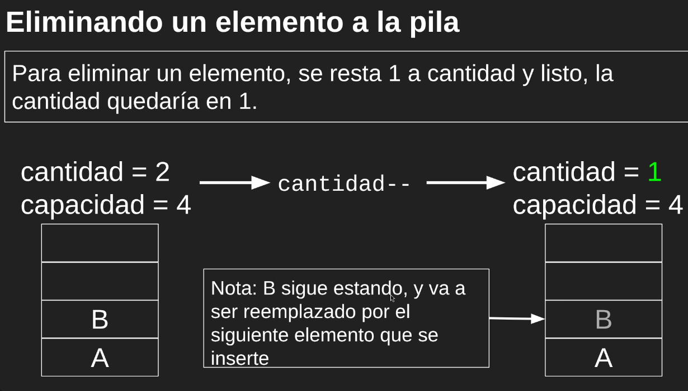
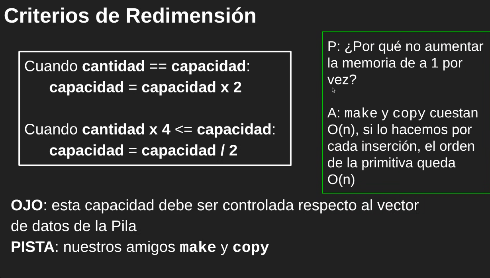
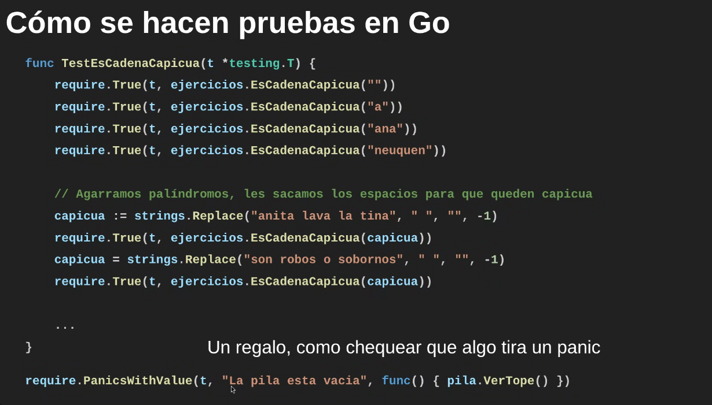

# Tipo Abstracto de Datos (TAD/TDA)

Modelo de dato que tiene un comportamiento y representa algo.

Es un conjunto de valores y de operaciones definidos mediante una especificación independiente de cualquier representación

Únicamente diferenciamos entre qué hace y cómo lo hace.

No debemos acceder de manera directa a los atributos de un TDA, si no tiene que modificarla mediante sus primitivas (métodos).

A su vez, no queremos que a los atributos se acceda de manera deliberada, por lo tanto escribimos su primera letra en minúscula para restringir el acceso desde módulos ajenos.

Siempre tiene que procesarse en tiempo constante O(1). 

Por ejemplo, definimos el TAD `puerta`:
```go
package puertas

type Puerta struct {
    estaAbierta bool 
}

// Devolvemos la dirección para la persistencia de datos
func CrearPuerta() *Puerta {
    return &Puerta{false}
}
func (puerta *Puerta) Abrir() {
    return puerta.estaAbierta = true
}
func (puerta *Puerta) Cerrar() {
    return puerta.estaAbierta = true
}
func (puerta *Puerta) EstaAbierta() bool {
    return puerta.estaAbierta
}

type Puerta interface {
    Abrir()
    Cerrar()
    EstaAbierta() bool
}

// se pueden hacer interfaces compuestas
type PuertaConAngulo interface {
    Puerta
    PuertaConAngulo()
}

```

## Generics
Permite escribir funciones de manera genérica:
```go
func invertir[T any](elems []T) []T {
    total := len(elems)
    res := make([]T, total)
    for i := range elems {
        res[total-i-1] = elems[i]
    }
    return res
}

letritas := []string{"si", "coso"}

// y la llamamos con
intInvertidos := invertir[string](letritas)
```

Tambien se pueden hacer structs dinámicos
```go
type ArregloDinamico T[any] {
    ArregloDinamico T[any]
}
```

## Pila


Estructura LIFO (Last In First Out).

Operaciones:
- Apilar
- Desapilar
- Ver tope
- ¿Está vacía?

Aplicaciones:
- Stack
- Blockchain (lenguaje de pila)
- Balanceo de paréntesis, llaves, etc

## Cola

Estructura FIFO (invariante del TDA): First In First Out.

Operaciones:
- Encolar
- Desencolar
- ¿Está vacía?

## Criterios de Redimensión


No usamos `append` porque este mismo modifica el espacio del vector según el criterio del lenguaje.

## Testing


Los TDA creados siempre tienen que ser sometidos a pruebas. Cualquier bug es una prueba que no se escribió. 

### Por qué es necesario
- Para poder tener una certificación de que el TDA implementado funciona como se espera.
- Si a futuro cambiamos la implementación, no rompa el funcionamiento (y tener cómo validarlo).
- Para que si uso el TDA de alguien más pueda validar que este funciona como se espera.
- Para que otra persona pueda entender cómo usarlo.

### Cómo hacer pruebas
- Pruebas lo más unitarias posibles (que prueben cada uno casos específicos).
- Separar en funciones, al menos por funcionalidad o escenario.
- No vamos a ser excesivamente estrictos, pero es recomendado (incluso para otras materias).
- Siempre de lo más chico a lo más grande.