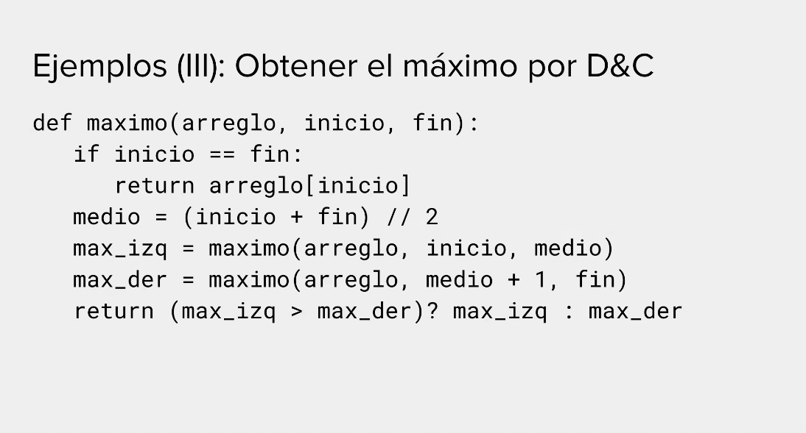

# División y Conquista

## Ordenamientos con División y Conquista

Nunca va a dar en tiempo constante.



Por lo tanto:

```
T(n) = 2T(n/2) + O(1)
```

### Mergesort
- Caso base: un elemento (o ninguno)
- Caso general: ordenamos mitad izquierda, ordenamos mitad derecha, intercalamos ordenadamente ambos resultados.

```python
def mergesort(inicio, final):
    if largo == 1
        return arr
    medio = largo // 2
    primera_mitad = arr[0.. medio]
    segunda_mitad = arr[medio.. largo]
    primera_ordenada = mergesort(primera_mitad, medio)
    segunda ordenada = mergesort(segunda_mitad, medio - 1)
```

#### Complejidad
```
T(n) = 2T(n/2)+O(n) = 2T(2^k/2)+O(2^k) =
T(2^k-1) = 2T(2^k-2) + O(2^k-1) = 
T(n) = 2 * sumatoria desde i = 0 a k - 1 de (2^i * O(2^k-i-1)) + O(2^k) =
T(n) = sumatoria desde i = 0 a k-1 de O(2^k) + O(2^k) = 
T(n) = O(n * log n)
```

### Quicksort
- Caso base: un elemento (o ninguno)
- Caso general: elegimos un pivote aleatorio, creamos dos arreglos auxiliares, uno que va a tener los menores al pivote, y otro los mayores. Ordenamos ambos arreglos recursivamente.

Esto tiene un problema, en el caso de que el arreglo ya esté ordenado, el algoritmo tiene complejidad cuadrática, por lo que nunca utilizamos el primer elemento como pivote.

#### Complejidad
O(n * log n) gracias a la aleatoriedad.

### Búsqueda Binaria
La complejidad de la búsqueda binaria es O(log n)

## Teorema maestro para el cálculo de complejidad algorítmica
```
T(n) = A * T(n/B) + O(n^C)

con X = logB(A)
Si X > C = O(n^C)
Si X = C = O(n^C * logB(n)) = O(n^C * log n)
Si X < C = O(n^logB(A))
```
Con A un número natural != 0, B un número real > 1

Únicamente válida para División y Conquista (sino, no existe el término B).

- A: Cantidad de llamados recursivos
- B: Proporción del tamaño con el cual estoy dividiendo el arreglo
- C: Demás operaciones

### Ejemplos
```
Mergesort:
log2(2) = 1 = C -> O(n log n)

Búsqueda binaria:
T(n) = T(n/2) + O(1) -> A=1, B=2, C=0
log2(1) = 0 = C -> T(n) = O(n^0 * log n) = O(log n)
```

## Notas adicionales
El caso base tiende a estar más relacionado con el problema que con el algoritmo.
