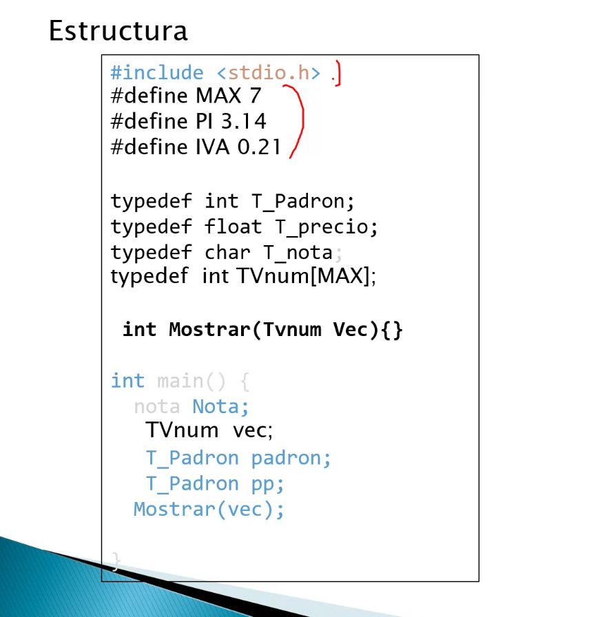
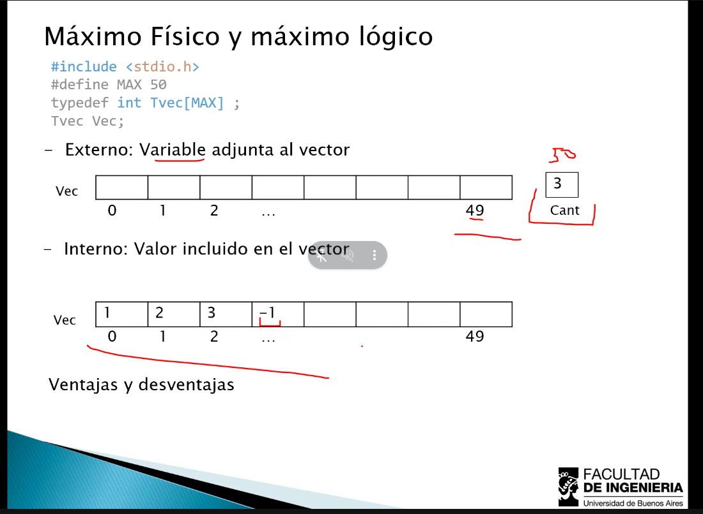
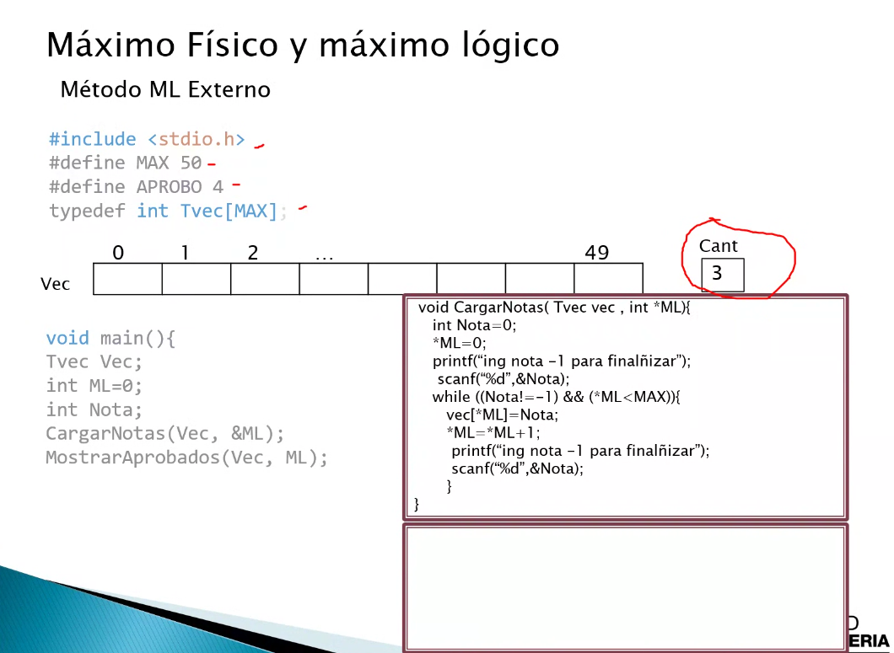
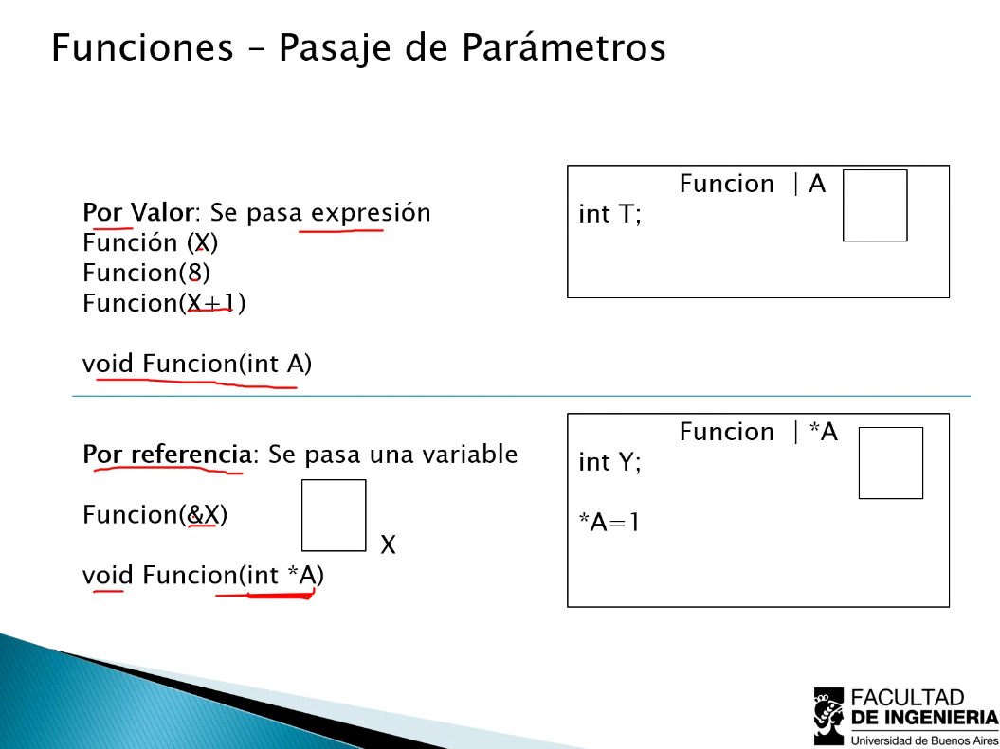

1 entero son 4 bytes

## Métodos ML (máximo lógico) | Interno vs Externo

el externo puede usarse con `while` y con `for`, pero agrega una variable. En el caso del interno, si bien te ahorrás la variable extra tenés q lidiar con que necesitás ese valor que de el freno, que en muchas ocasiones no va a estar presente, además de poder utilizar únicamente `while`.

En el caso del ML, se utiliza el pasaje por referencia de manera tal de que, aunque se termine la función, el valor se mantenga durante el programa y se de a conocer el máximo lógico.

