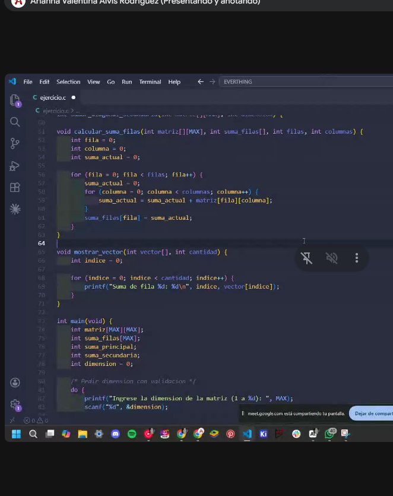

# Arreglos

Este es el anteúltimo tema antes del parcial (el último es cadenas), el cual es el 13/5 a las 19HS. 

En los arrays se almacenan múltiples valores. Al momento en el cual se definen se reserva ese espacio en memoria para los valores, por eso es importante especificarlos. 

El vector SIEMPRE se pasa por referencia: `vector` == `&vector[0]`

### Sintaxis:
```c
<tipo_base> nombre[cantidad];
// ej 1
int vector[4];
// ej 2
int vector2[4] = {15, 27, 68, 73};
// ej 3
int vector3[] = {15, 27, 68, 73, ...};
```
- `<tipo_base>`: Tipo de elementos del arreglo,
- `nombre`: nombre del arreglo, y
- `cantidad`: cantidad de elementos dentro del array

Notese que en el ejemplo 3, al no especificar una cantidad el array se flexibiliza automáticamente dependiendo de la cantidad de elementos.

### Funciones
```c
int variable_cualquiera;
int vector[] = {1, 2, 3, 4, 5};

sizeof(variable_cualquiera); // cantidad de bytes de una variable
int tamanio = sizeof(vector) / sizeof(vector[0]) // calcula el tamaño del vector
```

### Máximo lógico vs Máximo físico
- **Lógico**: los que me interesan
- **Físico**: capacidad real

## Arreglos multidimensionales -> Matrices

### Sintaxis
```c
int matriz[rows][cols]
// o
int matriz[rows, cols]
// ej 1
int matriz[3][3] = {
    {1, 2, 3},
    {4, 5, 6},
    (7, 8, 9)
};
```
Al igual que en los arrays, si no se especifican la cantidad de filas y/o columnas se pueden colocar corchetes vacíos y se calculan automáticamente.

## Consideraciones antes del parcial
- Cada arreglo tiene un mismo concepto. Importante, tachan ejercicios por esto.
- Es únicamente práctico
- Las matrices las consideran primero filas y después columnas

## Ejercicios
```c
#include <stdio.h>

#define FILAS 3
#define COLUMNAS 3

int crearMatriz() {
    int val1, val2, val3, val4, val5, val6, val7, val8, val9, contador, i;
    contador = 9
    for (i=0;i<10;i++) {
        printf("Ingrese un número para la matriz. %d restantes: ", contador);
        scanf("%d", &val1);
        contador -= 1;
    }
}

