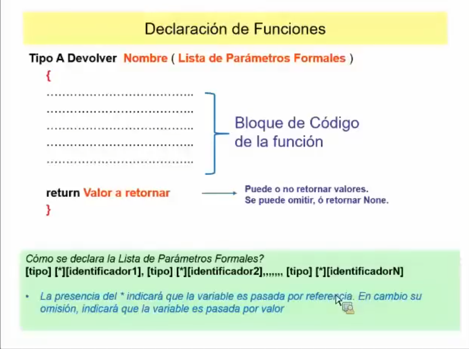
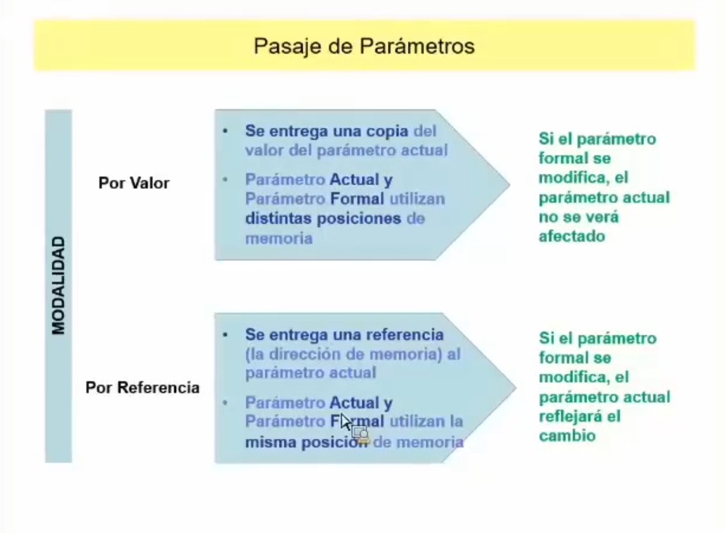
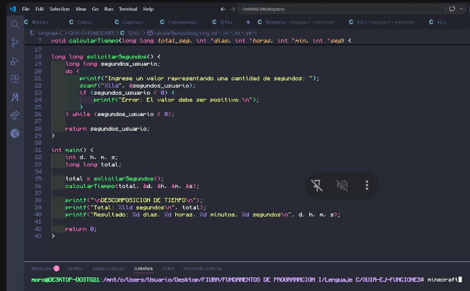

```c
#include <stdio.h>

// El entero 'a' y el entero 'b' son PARÁMETROS FORMALES
int sumar(int a, int b) {
    return a + b;
}

int main() {
    int x = 10;
    int y = 20;

    // 'x' y 'y' son los PARÁMETROS ACTUALES (o argumentos)
    int resultado = sumar(x, y); 
    
    // También puedes pasar valores directos (literales)
    // Aquí 5 y 7 son los PARÁMETROS ACTUALES
    int otro_resultado = sumar(5, 7);

    printf("%d", resultado);
    return 0;
}
```
cant formales = actuales

si tenemos que devolver mas de una cosa en C, entonces usamos funciones por referencia, pero de devolver un unico valor utilizaremos funciones tipadas (valor)

