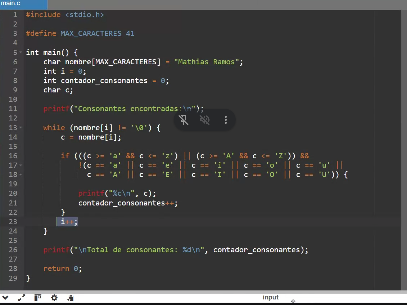

# cadenas

## ejercicios


## libreria string.h
```c
# include <stdio.h>
# include <string.h>

char cadena1[10] = "HOLA";
char cadena2[] = " ";
char cadena3[] = "MUNDO";

// devuelve la longitud de una cadena, ignorando la cantidad máxima, si no fijándose en los espacios ocupados
int cantChars = strlen(cadena1);

// permite asignar un nuevo valor a una cadena
// hay que tener en cuenta la longitud de la cadena
char strcpy(cadena1, "CHAU");

// concateno valores a una cadena
strcat(cadena1, cadena2);
strcat(cadena1, cadena3);

// comparo 2 cadenas
if (strcmp(cadena1, cadena2) == 0);
```
- strcmp permite comparar 2 cadenas -> incluída en libreria standard
- strstr: busco cadena en otra cadena

# switch
```c
switch (mes) {
    case 1:
        printf("Enero");
        break;
    case 2:
        printf("Febrero");
        break;
    ...
}
```

# parcial
- por lo general no se necesita utilizar switch
- son 3 ejercicios
- pasajes de parametros toman en 2 ejercicios
- tenes que saber un poco de todo, no hay una fórmula matemática
- no usar break
- las variables se tienden a inicializar adentro de las funciones para que esos valores dependan de la función
- no entran cadenas en el examen