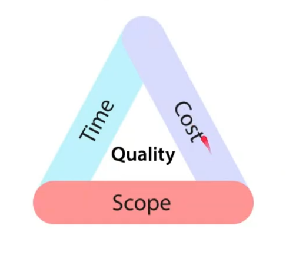
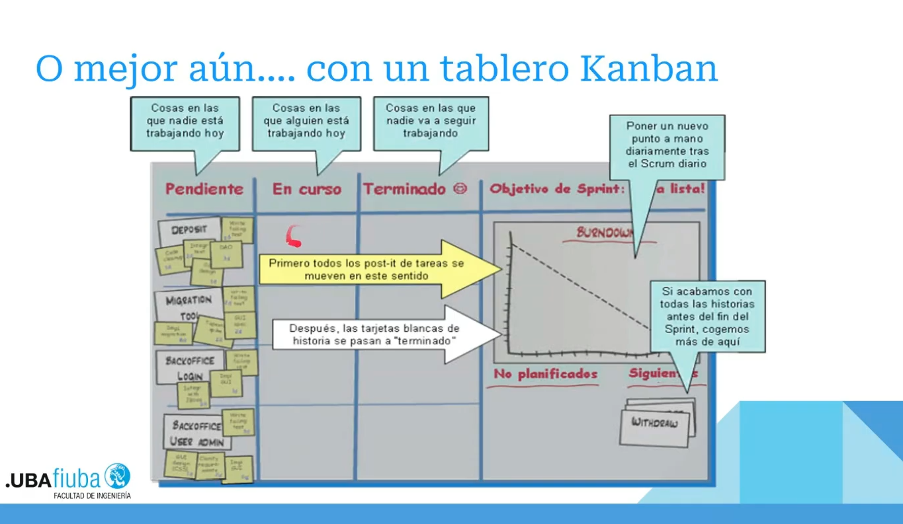
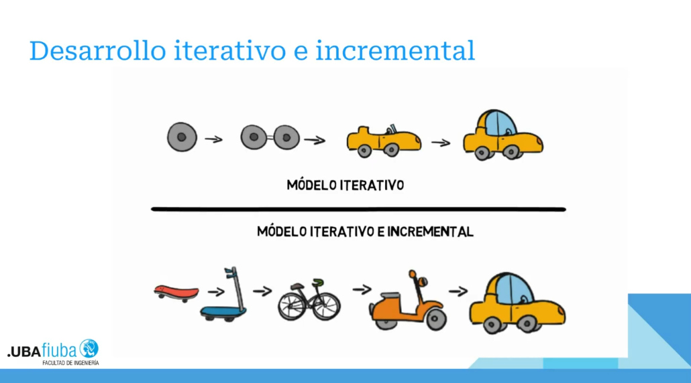

# Metodologías ágiles a la hora de trabajar en proyectos

Un proyecto puede ser visto como una serie de tareas que tienen un objetivo a cumplir específico, que tiene una fecha de comienzo y fin definidas, y un presupuesto de tanto recursos como tiempo.

Cosas que acomplejizan los proyectos: tamaño, dificultad, variedad, cambio (atado a los requerimientos originales)

Problemas en la gestión de proyectos: requerimientos fuera de control, no cumplimiento de los tiempos, desvíos en la planificación, estimaciones deficientes, re-trabajo excesivo, baja calidad, costos excedidos, insatisfacción del cliente, insatisfacción de los profesionales participantes...

Las variables en un proyecto son el calendario, el esfuerzo, el alcance (lo que tenés que hacer en el proyecto), en el medio de estas tres la calidad.

Podemos observar que si estiramos una aumentan las otras 2, siempre siendo un triángulo equilátero. Pero por más que movamos las cosas, no se tiene que modificar la calidad (satisfacción del cliente hacia el producto), ya que nunca se escatima en ella.

# Scrum
Es un proceso ágil que nos permite centraron en ofrecer el más alto valor de negocio en el menor tiempo. 

Sirve para solucionar el problema de que el cliente realmente sepa lo que quiere y/o espera del producto. En lugar del castillo completo, le das pequeñas partes de un castillo para que vaya viendo si estamos en la misma página.

- Nos permite rápidamente y en repetidas ocasiones inspeccionar el producto/servicio de trabajo (cada dos semanas o un mes)
- El negocio fija las prioridades. Los equipos se auto-organizan a fin de determinar la mejor manera de entregar las funcionalñidades de más alta prioridad.
- Cada dos semanas o un mes, cualquiera puede ver lo que generamos funcionando y decidir si liberarlo o seguir mejorándolo en otro sprint.
- Proceso simple que requiere mucha disciplina para que resulte exitoso.
- Ampliamente usado en compañías de todo tipo.
- No hay prácticas de ingeniería prescritas.

## Roles

### Product owner 
El dueño del proceso (tanto un empleado como también puede ser un cliente), mucha palanca dentro de la empresa.

- Define funcionalidades
- Responsable del ROI
- Prioriza funcionalidade de acuerdo al valor del mercado/negocio
- Ajusta funcionalidades y prioridades en cada iteración si es necesario
- Acepta o rechaza los resultados del trabajo en equipo

### Scrum master
Líder del proceso, encargado de manejar las reuniones, más peso en el equipo.

- Representa la gestión del proyecto
- Responsable de promover los valroes y prácticas del Scrum
- Remueve impedimentos
- Se asegura de que el equipo es completamente funcional y productivo
- Permite la estrecha cooperación de todos los roles y funciones

### Team 
Típicamente entre 5 a 9 personas

- Multi-funcional (programadores, testers, analistas, diseñadores, profesional del área, etc...)
- Los miembros deben ser full-time (puede haber excepciones)
- Los equipos son auto-organizativos
- Únicamente puede haber cambio de miembros entre los sprints

## Reuniones

### Sprint planning
Determinar que vas a hacer en el sprint, se prioriza evaluar el product backlog y seleccionar un objetivo concreto y cómo resolverlo, y estimar las horas. Entre TODOS.

- Capacidad del equipo
- Product backlog
- Se crea el sprint backlog
- Condiciones del negocio
- Producto actual
- Tecnología

### Daily scrum
Cada 24 horas se hacen reuniones diarias breves, para saber que está haciendo cada uno. Responde 3 preguntas: qué hiciste ayer, qué vas a hacer hoy y qué obstáculo tenés en tu camino.

- Sinceridad
- Parados
- 15 minutos máximo
- No para solución de problemas
- Puede entrar cualquiera, pero solo los miembros del equipo pueden participar
- Misma hora, todos los días, mismo sitio

### Sprint review
Una vez finalizado el sprint, se hace una reunión de revisión con el cliente

### Sprint retrospective
Dice que cosas se hicieron bien y que se podría mejorar. El scrum manager anota todas las respuestas y el equipo prioriza las mejoras posibles. Finalmente el scrum manager intenta ayudarlos a encontrar la mejor manera de trabajar con Scrum.

## Artefactos

### Product backlog
El Product Backlog es una lista ordenada y dinámica de todo lo necesario para mejorar un producto (funcionalidades, mejoras, correcciones, requisitos técnicos). Es la única fuente de trabajo para el equipo Scrum, gestionada por el Product Owner, y evoluciona constantemente según el feedback y las necesidades del negocio.

Lista de todo lo necesario para concluir el producto (user stories + tareas pendientes).   

---

### Sprint backlog
Tareas del sprint

---

### Burndown charts

---

## Sprint
Módulos en los que vamos a hacer cosas durante 15 (lo ideal) o 30 días. Finalizado este periodo tenemos que tener cosas útiles y funcionales que podamos entregarle al cliente

Durante el sprint, ni siquiera el cliente puede interrumpir las tareas, a menos que sean MUY graves, por ejemplo que la tecnología acordada no funciona, circunstancias de negocio han cambiado o el equipo tiene interferencias. Y en estos casos lo único que se puede hacer es ABORTAR el sprint.

## Desarrollo iterativo e incremental

## User story
Es lo que el usuario necesita, y genera un listado de tareas desarrollado por vos

## Estimación
Se utiliza la estrategia del Planning poker, que es un juego dentro del equipo que nos permite estimar.

- Se tienen tarjetas con números que representan puntos, dependiendo del tamaño de la tarea
- Cada participante tiene una tarjeta donde coloa lo que cree que esa tarea vale
- Se muestran todas las tarjetas
- Si las estimaciones son similares se toma esa estimación
- Caso contrario se discuten los puntos de vista y se vuelve a estimar 