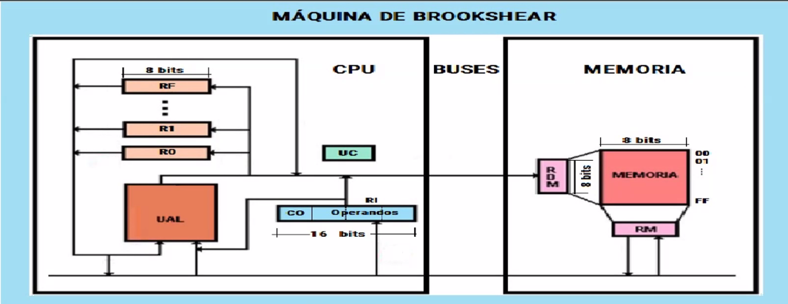

# Máquina ELemental
- Datos: información 
- Información: conjunto de datos relacionados con un contexto

La unidad mínima de información es un Bit (Binary Digit / Biestable). De aquí nació el concepto de byte, que son 8 bits.

## Generaciones de computadoras
Computadoras -> realizan cómputos.

### Generación 1 - Tubos de vacío
- Turing: COLOSSUS - computadora electrónica (1943)
- Mauchley / Eckert: ENIAC - Programable por switches (1946)
- Von Neumann: IAS Machine - Programa almacenado (1950)

En esta generación se consideraba que las mujeres estaban más capacitadas para manejar cables por ser más prolijas y cuidadosas, por lo que era común encontrarlas en estos contextos.

### Generación 2 - Transistores (1955-1965)
- DEC: PDP1 - Primera minicomputadora (1961) | PDP 8 - Primera mini masivoa / Omnibus (1965)
- Burroughs: B5000 - Primera computadora diseñada para un lenguaje de alto nivel (1963)

### Generación 3 - Circuitos Integrados (1965-1980)

### Generacion 4 - (1980-?)
- IBM: Comienzo de las primeras computadoras personales (1981)
- APPLE: Apple Lisa - Primera computadora con GUI (1983)

### Generación 5 - Computadoras "invisibles"
La expansión hacia distintos tipos de electrodomésticos y dispositivos, tales como celulares o relojes.

## Arquitectura de Von Neumann
Consta de un CPU que está conectado a 2 tipos de circuitos:
- Unidad de lógica aritmética: el nombre lo indica, se encarga de las operaciones
- Unidad de control: controla las operaciones aritméticas.

En esta arquitectura también tenemos la memoria, donde por un lado es memoria RAM y otra memoria ROM (que sirve para el arranque de la computadora y para aplicaciones específicas). 

Y el último componente serían los periféricos.

### Principios básicos de Von Neumann
- Programa almacenado: tanto las instrucciones como los datos que en ellas se usan residen en una misma memoria.
- Ruptura de secuencia: debe existir una instrucción que permita a la máquina no seguir con la secuencia de ejecución.

## Maquina de Brookshear
Concepto didáctico de cómo entender cómo está compuesto un procesador

### Conceptos subyacentes
- Compuertas: OR, AND... 
- Registros: Guarda una operación (concepto de memoria)
- Celda de memoria: guarda direcciones y contenidos de esas direcciones
- Bus: paralelización (viajan de manera simultánea 1 bit por cada cable del procesador)

### Características de Brookshear
- 16 registros de propósito general de R0 a RF
- Registros de 1 byte
- Memoria principal consta de 256 bytes
- 1 Registro de instrucción de 16 bits

### Instrucciones

| Opcode | Nombre | Operación |
| :---: | :--- | :--- |
| **`1`** | LOAD M | `R = Memoria[XY]` |
| **`2`** | LOAD C | `R = XY` |
| **`3`** | STORE | `Memoria[XY] = R` |
| **`4`** | MOVE | `S = R` |
| **`5`** | ADD | `R = S + T` |
| **`6`** | ADD Float | `R = S + T` (Flotante) |
| **`7` / `8` / `9`** | Lógica | `OR` / `AND` / `XOR` entre `S` y `T` |
| **`A`** | ROTATE | Rota bits de `R` a la derecha |
| **`B`** | JUMP | Si `R == R0` salta a `XY` |
| **`C`** | HALT | Detener máquina |

Curiosamente, cuando apretamos `CTRL + C` también corta los procesos de terminal!

### Ejemplos
Cada una de las posiciones de memoria almacenan 8 bits

- 1RXY -> 0001 0101 1100 1111, donde cada dígito hexadecimal después del 1 representa la posición en memoria de 8 bits, osea 15CF, que almacena a 1RXY. El 1 representa la instrucción.
- 2RXY -> 0010 0101 1100 1111 -> 25CF que ahora el 2 representa la instrucción y el 5 la posición en memoria.
- 3RXY -> 35CF: Agarra el número que está en el registro 5 y guardalo en el CF.