# Lógica digital

Las computadoras necesitan almacenar datos e instrucciones en memoria. Utilizan mayoritariamente el binario, ya que tener solo 2 estados posibles hace muy sensillo identificar entre sólo dos estados, siendo así menos propenso a errores.

## Operadores Básicos
- AND `.`
- OR `+`
- NOT `_`

El orden de precedencia es: NOT -> AND -> OR. Se recomienda hacer una tabla en funcion de todas las posibles combinaciones, con una columna por cada valor y operador.

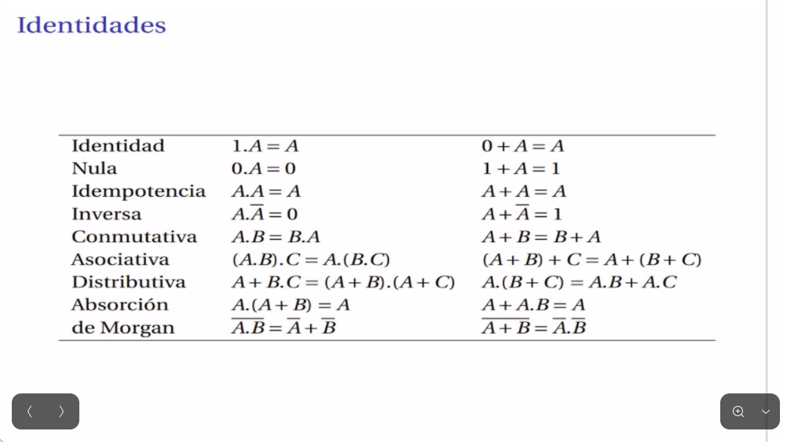

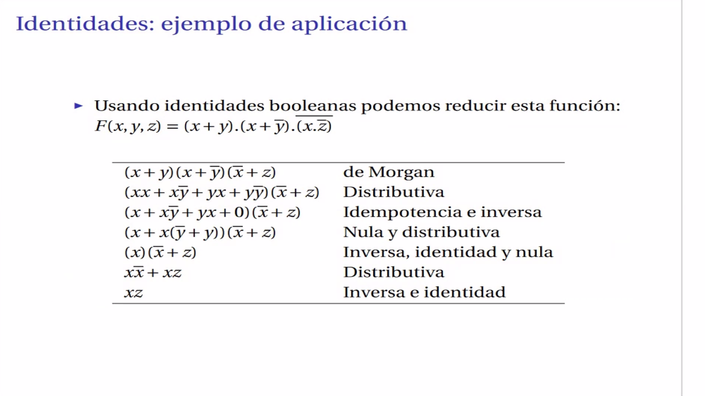

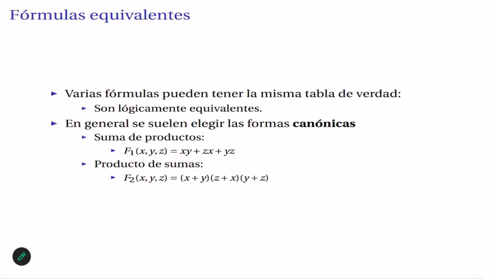

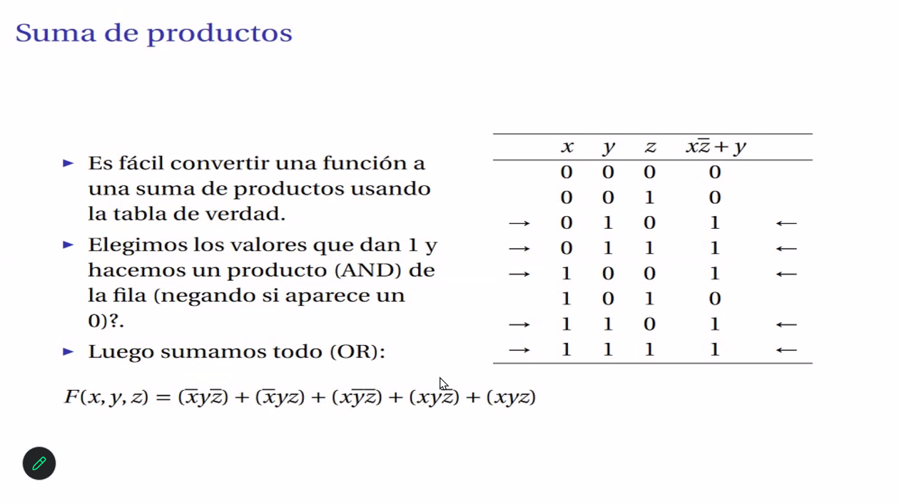

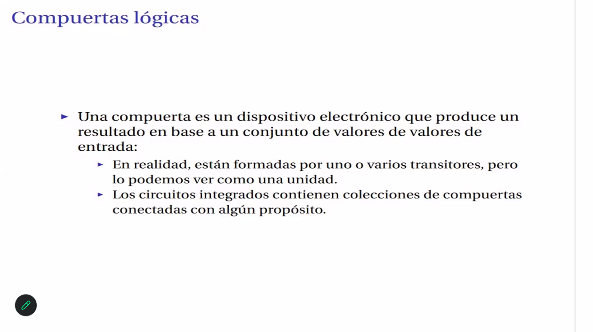

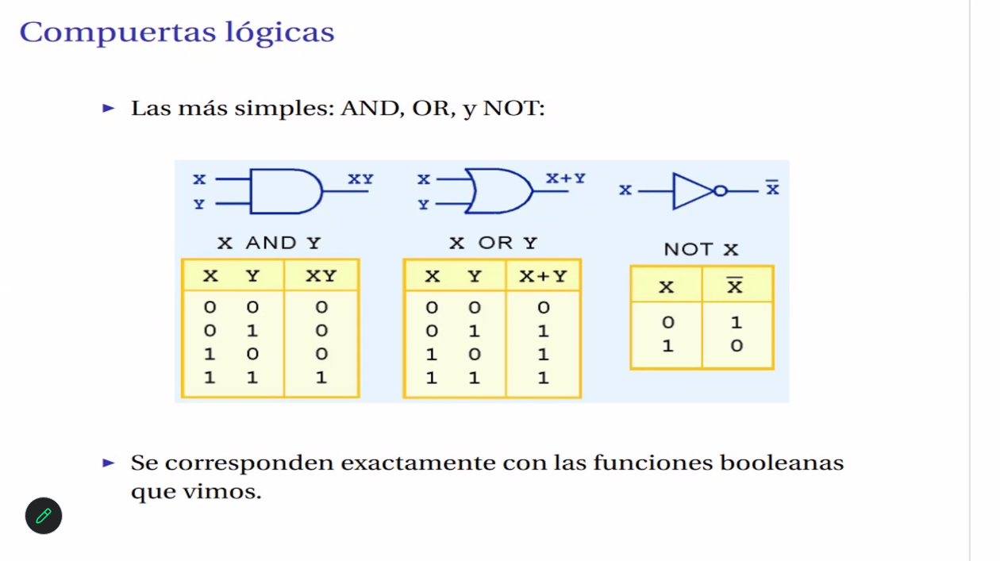

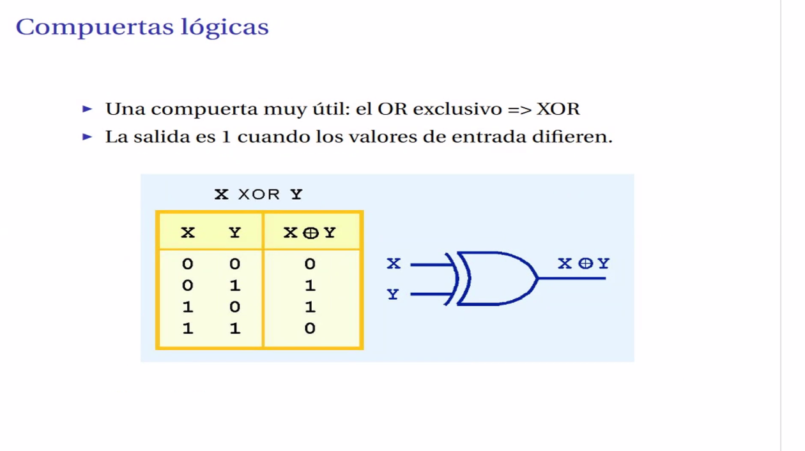

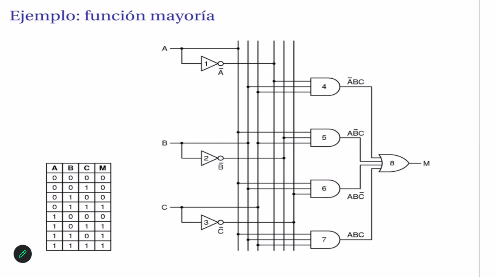

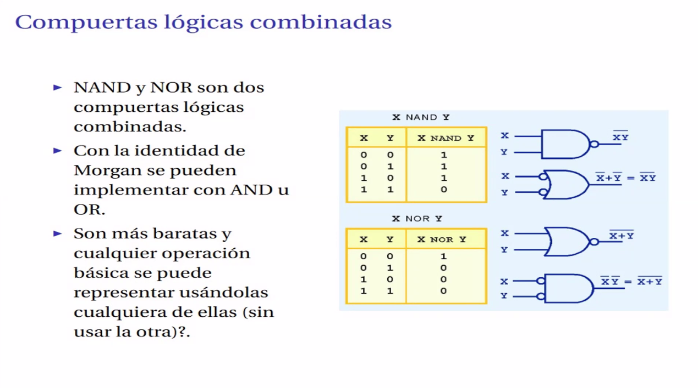

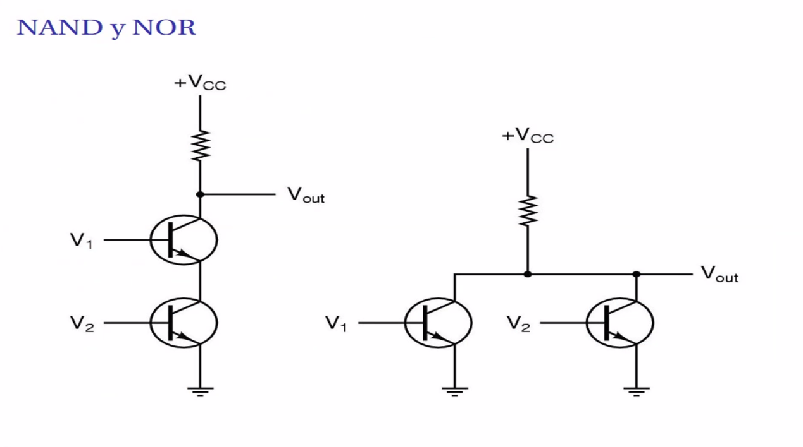

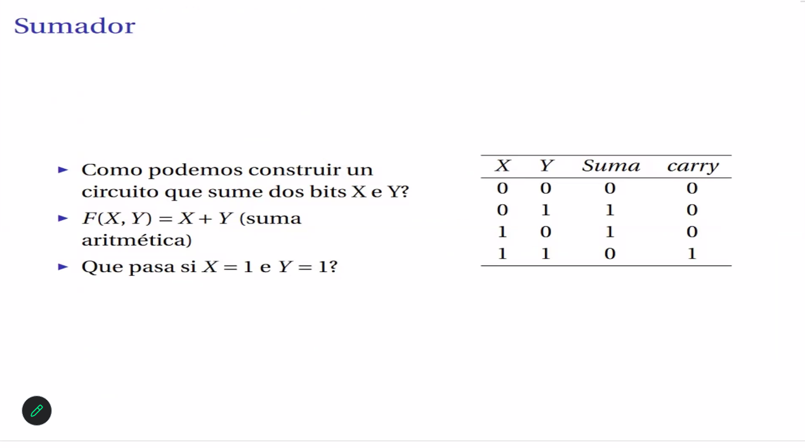

SE PUEDEN HACER TODOS MENOS EL 12 Y EL 13   